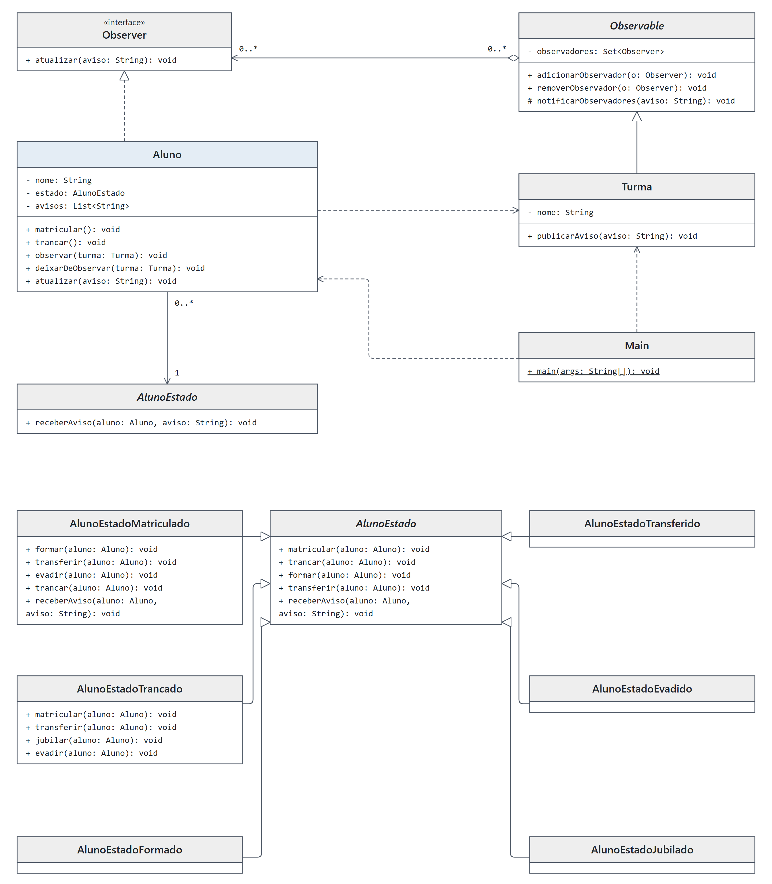
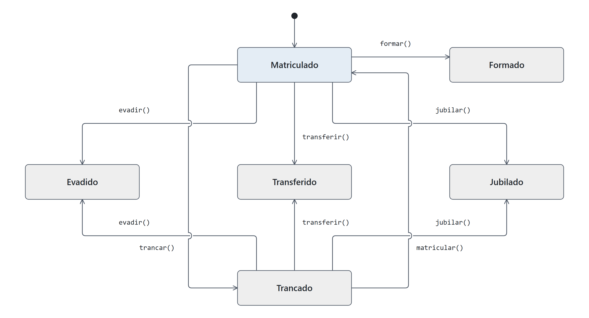

# DCC078 - Padrões de Projeto: State e Observer

**Aluno:** Felipe Lazzarini Cunha

## Tema

Continuação do cenário de alunos e turmas apresentado em aula. O State controla as transições da situação acadêmica do aluno, enquanto o Observer permite que a turma publique avisos aos alunos inscritos. A integração ocorre quando o aluno delega o recebimento do aviso ao seu estado atual: somente o estado matriculado registra a mensagem. Ao trancar, o aluno deixa de receber avisos; ao se rematricular, volta a recebê-los. Essa regra de recebimento foi proposta para integrar os exemplos das aulas. As notificações são simuladas e armazenadas em memória.

## Diagrama de Classes UML



## Diagrama de Estados UML



## Estrutura do Projeto

- `Aluno`: mantém o estado acadêmico, observa turmas e armazena os avisos recebidos.
- `AlunoEstado` e suas seis implementações: definem as transições permitidas e a reação às notificações.
- `Observer` e `Observable`: definem o observador e o cadastro, a remoção e a notificação de observadores.
- `Turma`: publica avisos para os observadores cadastrados.
- `Main`: demonstra o recebimento de avisos antes do trancamento e após a rematrícula.

## Testes

Requisitos: Java 17 e Maven 3.9 ou superior.

```bash
mvn test
```
